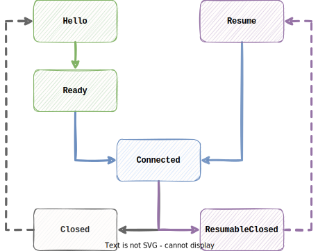

# Gateway

  
  
  

A minimal implementation for the [Discord gateway](https://discord.com/developers/docs/topics/gateway) logic using 
the state pattern. The goal is to provide the Discord gateway behavior as a library to quickly build correct shard 
implementation. A functional shard implementation using [github.com/gobwas/ws](https://github.com/gobwas/ws) can be found at [gatewayutil sub-package](./gatewayutil).

# Design
A client is holds a state that affects how the next incoming message is processed. To begin with, the client is given a
[HelloState](./state_hello.go), which transitions into a [ReadyState](./state_ready.go), which again transitions into a [ConnectedState](./state_connected.go). Each state is named in 
accordance with each phase of the [gateway connection setup guide](https://discord.com/developers/docs/topics/gateway#connection-lifecycle), 
and are responsible for processing different Discord messages.

The different client methods takes the websocket connection as parameters in accordance with the
io package (Reader, Writer), instead of writing an abstraction compliant wrapper of whatever websocket library you
want to use.

A closed client is considered dead, and can not be used for future Discord events. A new client must be created. 
Specify the "dead client" as a parent allows the new client to potentially resume instead of creating a fresh session.

## Live bot for testing
There is a bot running the gobwas code. Found in the cmd subdir. If you want to help out the "stress testing", you can add the bot here: https://discord.com/oauth2/authorize?scope=bot&client_id=792491747711123486&permissions=0

It only reads incoming events and waits to crash. Once any alerts such as warning, error, fatal, panic triggers; I get a notification so I can quickly patch the problem!

## Support

 - [X] operation codes
 - [X] close codes
 - [X] Intents
 - [x] Events
 - [x] JSON
 - [x] ETF (see the [encoding package](./encoding))
 - [x] Rate limit
   - [x] Identify (local implementation)
   - [x] Commands (local implementation)
 - [ ] Shard(s) manager
 - [ ] Buffer pool

Use the existing disgord channels for discussion

  
  

